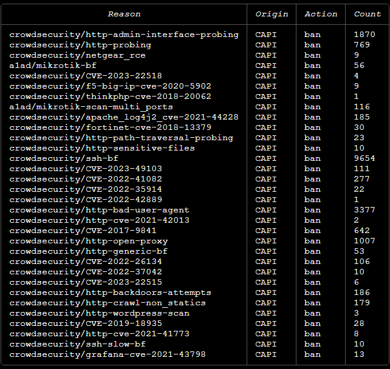
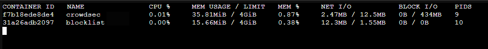

# Crowdsec Blocklist

<p align="center">

 </p>

**Crowdsec Blacklist mirror** - allows you to create a local HTTP service with an up-to-date list of harmful IP addresses

CrowdSec is an open and extensible tool for detecting and preventing cyber attacks. It is based on the collective intelligence of the community, using adaptive and aggregated data on network activity to identify and block potential threats. The platform uses machine learning and big data analysis techniques to continuously improve its algorithms and learn from new threats. 

It uses behavioral patterns to identify potentially malicious activity and can block access from such addresses. CrowdSec also allows you to create individual ban lists and use common ban lists generated by the user community.

- [DockerHub crowdsec](https://hub.docker.com/r/crowdsecurity/crowdsec)
- [DockerHub blocklist-mirror](https://hub.docker.com/r/crowdsecurity/blocklist-mirror)
- [Docs Blocklist mirror](https://docs.crowdsec.net/u/bouncers/blocklist-mirror#installation/)


## Installation using docker compose

Clone repo 

Install the required versions in `docker-compose.yaml`

up crowdsec
```
docker compose up -d
```

You need add bouncers to get the `lapi_key` command

```shell
docker compose exec crowdsec cscli bouncers add blocklistMirror
```

Example output:
> API key for 'blocklistMirror':
> 
> hsevAVxNwExampleTkeyfdssdfrqNyTsdy51/U
> 
> Please keep this key since you will not be able to retrieve it!

Change the received key in the `crowdsec-blocklist-mirror.yaml` file to the value of `lapi_key`

```shell
docker compose restart
```

## Сhecking

Open in a browser

- **Crowdsec** - `http://YOUR_IP:6060/metrics `

```
# HELP cs_active_decisions Number of active decisions.
# TYPE cs_active_decisions gauge
cs_active_decisions{action="ban",origin="CAPI",reason="a1ad/mikrotik-bf"} 55
cs_active_decisions{action="ban",origin="CAPI",reason="a1ad/mikrotik-scan-multi_ports"} 112
cs_active_decisions{action="ban",origin="CAPI",reason="crowdsecurity/CVE-2017-9841"} 618
cs_active_decisions{action="ban",origin="CAPI",reason="crowdsecurity/CVE-2019-18935"} 28
cs_active_decisions{action="ban",origin="CAPI",reason="crowdsecurity/CVE-2022-26134"} 103
cs_active_decisions{action="ban",origin="CAPI",reason="crowdsecurity/fortinet-cve-2018-13379"} 29
cs_active_decisions{action="ban",origin="CAPI",reason="crowdsecurity/grafana-cve-2021-43798"} 12
cs_active_decisions{action="ban",origin="CAPI",reason="crowdsecurity/http-admin-interface-probing"} 1782
cs_active_decisions{action="ban",origin="CAPI",reason="crowdsecurity/http-backdoors-attempts"} 177
cs_active_decisions{action="ban",origin="CAPI",reason="crowdsecurity/ssh-bf"} 9501
cs_active_decisions{action="ban",origin="CAPI",reason="crowdsecurity/ssh-slow-bf"} 9
cs_active_decisions{action="ban",origin="CAPI",reason="crowdsecurity/thinkphp-cve-2018-20062"} 1
...
```

- **Blocklist** - `http://YOUR_IP:41412/metrics` 
```
# HELP active_decision_count Total number of decisions served by any blocklist
# TYPE active_decision_count gauge
active_decision_count 18777
...
```

Above all:
- **Blocklist** - `http://YOUR_IP:41412/security/blocklist?ipv4only`

```
1.2.3.4
2.3.4.5
...
```

## Additional commands cli

all block list addresses
```shell
docker compose exec crowdsec cscli decisions list --origin CAPI -o raw 
```

collections list
```shell
docker compose exec crowdsec cscli collections list
```

You can change it in the `docker-compose' file.yaml` variable `COLLECTIONS`

```yaml
environment:
  COLLECTIONS: "crowdsecurity/linux a1ad/mikrotik crowdsecurity/traefik"
```

metrics
```shell
docker compose exec crowdsec cscli metrics
```



### Results

As a result, we get a local service with current dangerous IP addresses and can block where it is possible to filter traffic by IP addresses

- network devices (pfsence, mikrotik)
- firewalls (iptables, nftables, ipset)
- DNS (cloudflare)
- proxy (haproxy, traefik, nginx)
- etc

**Resources** `docker stats`:

