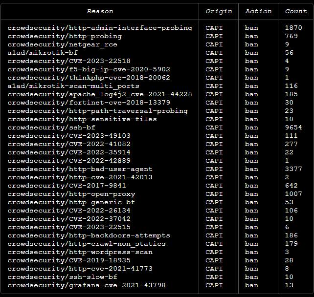
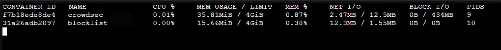

# Crowdsec Blocklist

<p align="center">

 </p>

**Crowdsec Blacklist mirror** - allows you to create a local HTTP service with an up-to-date list of harmful IP addresses

CrowdSec is an open and extensible tool for detecting and preventing cyber attacks. It is based on the collective intelligence of the community, using adaptive and aggregated data on network activity to identify and block potential threats. The platform uses machine learning and big data analysis techniques to continuously improve its algorithms and learn from new threats. 

It uses behavioral patterns to identify potentially malicious activity and can block access from such addresses. CrowdSec also allows you to create individual ban lists and use common ban lists generated by the user community.

- [DockerHub crowdsec](https://hub.docker.com/r/crowdsecurity/crowdsec)
- [DockerHub blocklist-mirror](https://hub.docker.com/r/crowdsecurity/blocklist-mirror)
- [Docs Blocklist mirror](https://docs.crowdsec.net/u/bouncers/blocklist-mirror#installation/)


## Installation using docker compose

Clone repo

Install the required versions in `docker-compose.yaml`

up crowdsec

```shell
docker compose up -d
```

You need add bouncers to get the `lapi_key` command

```shell
docker compose exec crowdsec cscli bouncers add blocklistMirror
```

Example output:
> API key for 'blocklistMirror':
> 
> hsevAVxNwExampleTkeyfdssdfrqNyTsdy51/U
> 
> Please keep this key since you will not be able to retrieve it!

Change the received key in the `.env` file to env `API_KEY`

```shell
docker compose restart
```

## Сhecking

Open in a browser

- **Crowdsec** - `http://localhost:6060/metrics `
- **Blocklist** - `http://localhost:41412/metrics` 

Above all:
- **Blocklist** - `http://localhost:41412/security/blocklist?ipv4only`

## Additional commands cli

count block list addresses

```shell
docker compose exec crowdsec cscli decisions list --origin CAPI -o raw | wc -l
```

collections list
```shell
docker compose exec crowdsec cscli collections list
```

You can change it in the `.env` variable `COLLECTIONS`

```shell
COLLECTIONS="crowdsecurity/linux a1ad/mikrotik crowdsecurity/traefik"
```

metrics

```shell
docker compose exec crowdsec cscli metrics
```



### Results

As a result, we get a local service with current dangerous IP addresses and can block where it is possible to filter traffic by IP addresses

- network devices (pfsence, mikrotik)
- firewalls (iptables, nftables, ipset)
- DNS (cloudflare)
- proxy (haproxy, traefik, nginx)
- etc

**Resources** `docker stats`:


